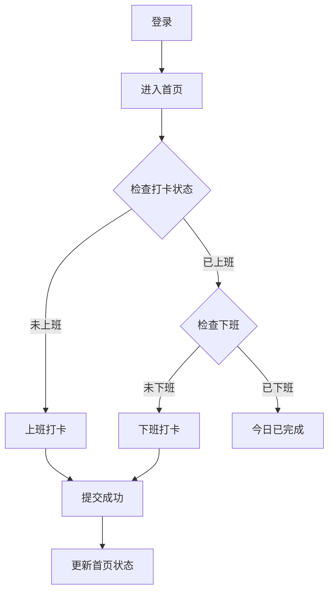

# 考勤应用 PRD 文档

## 1. 产品概述

一款简洁高效的企业考勤应用，支持员工上下班打卡、考勤记录查看、统计数据展示和请假申请功能。界面清新现代，操作流畅直观。

## 2. 核心功能

### 2.1 功能模块列表

1. **登录页**：工号+密码登录，记住登录状态
2. **首页仪表盘**：显示今日打卡状态、近期考勤概览
3. **打卡页**：上班打卡、下班打卡，带成功动画反馈
4. **考勤记录**：日历视图展示打卡状态，日列表详情
5. **统计报表**：月度考勤统计、异常考勤提示
6. **请假管理**：提交请假申请、查看请假记录

## 3. 核心流程

### 3.1 日常打卡流程

## 4. 用户界面设计

### 4.1 设计风格

- **主色**：#6366F1（靛蓝色）- 专业稳重
- **辅助色**：#10B981（翠绿色）- 成功状态
- **警示色**：#F59E0B（琥珀色）- 异常提示
- **背景**：#F8FAFC（浅灰白）
- **按钮**：圆角设计，带阴影和动效
- **字体**：Noto Sans SC（中文）、Inter（英文数字）

### 4.2 页面设计

| 页面 | 主要内容 |
|------|----------|
| 登录页 | Logo、表单（工号/密码）、登录按钮 |
| 首页 | 用户信息卡片、今日打卡状态、快速操作入口 |
| 打卡页 | 大型打卡按钮、时间显示、位置信息、打卡动画 |
| 考勤记录 | 月历视图、日打卡详情列表 |
| 统计报表 | 月度数据卡片、出勤统计图表 |
| 请假管理 | 请假申请表单、请假记录列表 |

## 5. 数据模型

- **用户**：工号、姓名、密码、部门、角色
- **打卡记录**：日期、上班时间、下班时间、打卡状态
- **请假记录**：请假类型、日期范围、原因、审批状态
