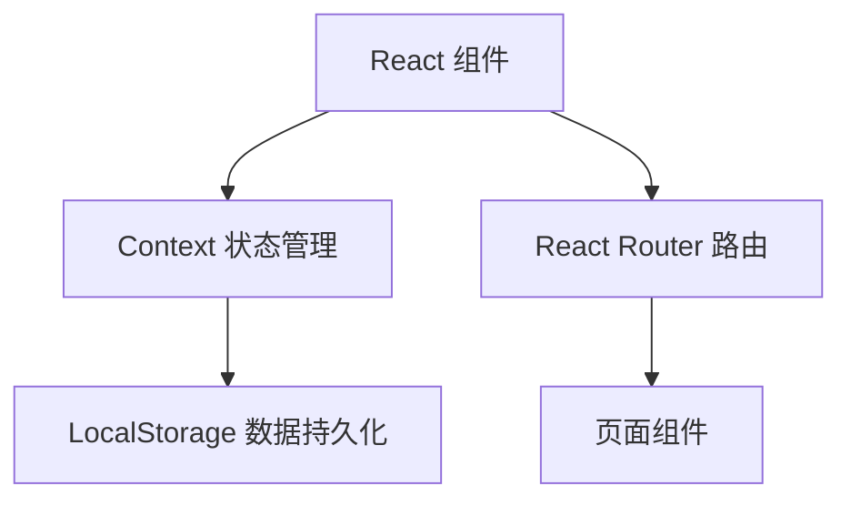

# 考勤应用技术架构文档

## 1. 架构设计



## 2. 技术选型

- **前端框架**：React@18
- **构建工具**：Vite
- **样式方案**：Tailwind CSS@3
- **路由管理**：React Router DOM@6
- **图标库**：Lucide React
- **动画方案**：CSS Animations + Tailwind 动效
- **数据存储**：LocalStorage（Mock数据）
- **日期处理**：Day.js

## 3. 路由定义

| 路由 | 页面 | 功能 |
|------|------|------|
| / | 登录页 | 工号密码登录 |
| /home | 首页 | 今日状态、快速入口 |
| /clock | 打卡页 | 上下班打卡 |
| /records | 考勤记录 | 日历视图查看 |
| /statistics | 统计报表 | 月度数据统计 |
| /leave | 请假管理 | 请假申请 |

## 4. 组件结构

```
src/
├── components/
│   ├── common/     # Button、Card、Input
│   ├── layout/     # Sidebar、Header
│   ├── attendance/ # ClockButton、Calendar、RecordList
│   └── statistics/ # StatCard、Chart
├── pages/          # Login、Home、Clock、Records、Statistics、Leave
├── hooks/          # useAuth、useAttendance
├── context/       # AuthContext、AttendanceContext
├── data/           # mockData
├── types/          # TypeScript 类型定义
└── utils/          # dateUtils、authUtils
```

## 5. 数据模型

### TypeScript 类型定义

```typescript
interface User {
  id: string;
  employeeId: string;
  name: string;
  department: string;
  role: 'employee' | 'admin';
}

interface AttendanceRecord {
  id: string;
  userId: string;
  date: string;
  checkIn: string | null;
  checkOut: string | null;
  status: 'normal' | 'late' | 'early' | 'absent';
}

interface LeaveRecord {
  id: string;
  userId: string;
  type: 'annual' | 'sick' | 'personal' | 'other';
  startDate: string;
  endDate: string;
  reason: string;
  status: 'pending' | 'approved' | 'rejected';
}
```

## 6. 状态管理

使用 React Context：

- **AuthContext**：用户登录状态
- **AttendanceContext**：打卡记录、考勤状态
- **LeaveContext**：请假申请状态
